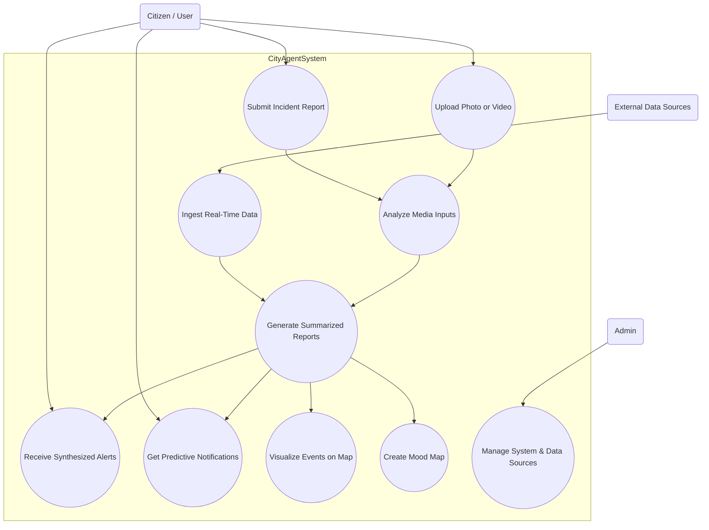

```mermaid
%%{init: { "theme": "default" }}%%
graph TD
    %% Actors
    Citizen(Citizen / User)
    Admin(Admin)
    External(External Data Sources)
    
    %% System as boundary
    subgraph CityAgentSystem
        SubmitReport((Submit Incident Report))
        UploadMedia((Upload Photo or Video))
        ReceiveAlerts((Receive Synthesized Alerts))
        GetNotifications((Get Predictive Notifications))
        IngestData((Ingest Real-Time Data))
        AnalyzeMedia((Analyze Media Inputs))
        GenerateSummary((Generate Summarized Reports))
        VisualizeMap((Visualize Events on Map))
        SentimentMap((Create Mood Map))
        ManageSystem((Manage System & Data Sources))
    end

    %% Relationships
    Citizen --> SubmitReport
    Citizen --> UploadMedia
    Citizen --> ReceiveAlerts
    Citizen --> GetNotifications

    External --> IngestData

    Admin --> ManageSystem

    SubmitReport --> AnalyzeMedia
    UploadMedia --> AnalyzeMedia
    IngestData --> GenerateSummary
    AnalyzeMedia --> GenerateSummary
    GenerateSummary --> ReceiveAlerts
    GenerateSummary --> VisualizeMap
    GenerateSummary --> GetNotifications
    GenerateSummary --> SentimentMap
```
